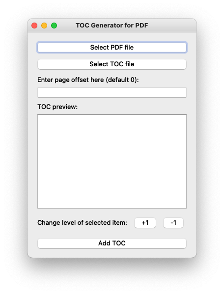
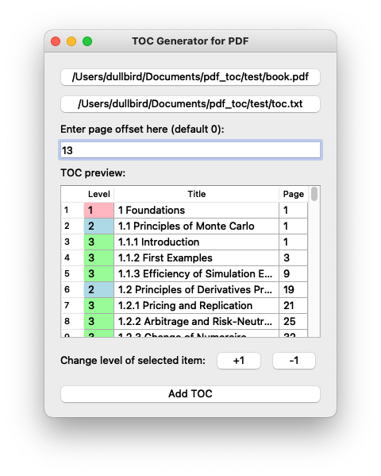

# PDF 目录生成器

[English](readme.md) | 中文版

## 简介

我们经常发现一些 PDF 文件没有目录（TOC），这使得我们阅读文件变得不方便，尤其是对于书籍而言。我建立了这个工具，帮助您生成一个目录。为此，您需要：

1. 一个 PDF 文件。
2. 一个 TOC 文件（.txt），以以下格式包含目录信息：

```
级别 标题 页码
```

一个示例：

```
1 标题 1 1
1.1 标题 2 2
1.2 标题 3 3
1.2.1 标题 4 4
2 标题 5 10
```

注意：

- 目前支持任意级标题。
- [PyMuPDF](https://pymupdf.readthedocs.io/en/latest/document.html#Document.set_toc) 对 TOC 有一些规则：
  - 它会删除先前的 TOC 并创建一个新的。
  - 级别是一个大于 0 的整数，第一项必须为 1，并且**最多比前一个大 1**。
  - 如果没有目标或目标是外部链接，页码可以设置为-1。

由于有时 TOC 文件可能不完全正确（从 PDF 文件中复制文本时可能会有一些拼写错误），我实现了一个预览面板，您可以在面板中预览和编辑级别（通过点击“+1”和“-1”按钮可以轻松完成）、标题或页面号码。

该工具支持页面偏移量，该偏移量将添加到 TOC 文件中的页面（正数或负数的整数，默认为 0）。

## 特点

- 一个编辑面板，用于调整标题、级别和页码
- 支持任意级别的内容
- 忽略 TOC（.txt）文件中的空行
- 高亮（红色背景）显示无效（非整数）的页码和无效（非整数或小于 1）的级别，并在检测到它们时停止添加 TOC

## 安装要求
Python 3（>=3.8）（其他版本可能也可以）
安装 PyQt5（>=5.9.2）和 PyMuPDF（>=1.22.5）（其他版本可能也可以）

## 安装
安装 Python
安装 PyQt5：
```
pip install PyQt5
```
或者
```
conda install -c anaconda pyqt
```
安装 PyMuPDF：
```
python -m pip install --upgrade pymupdf
```
## 使用
- 首先下载 git 仓库（您可以简单地下载 zip 文件并解压缩）。
- 进入包含 main.py 的文件夹，并运行以下命令：
```
python main.py
```
将显示一个窗口：



您可以运行测试：



输出文件将保存在与原始 PDF 文件相同的文件夹中。
